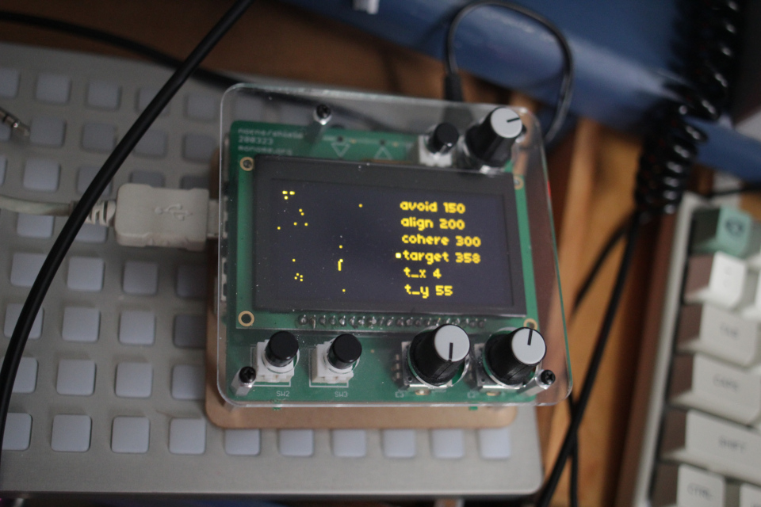

# Flock

Computer algorithms can model flocking behavior by simulating three steps:

1. Separation
2. Alignment
3. Cohesion

This script creates a simple flocking model which generates chaotic LFOs.

It is designed, for the moment, to work with Norns + Crow.

